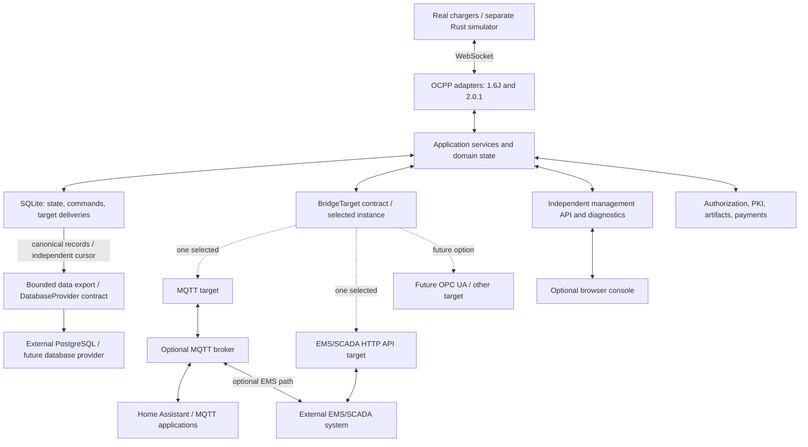

# Universal OCPP Bridge: native service, protocol adapters, and hardware-free test console

Status: implementation plan; no service or simulator has been implemented yet.

Current scope: edit this plan only. Service code, workflow/configuration files, dependency installation, and deployment are separate implementation work.

Last updated: 2026-08-31. MQTT and EMS/SCADA are selectable targets behind one Rust trait contract. Optional external database export has a separate provider contract. The plan includes a Rust simulator, browser debugging, isolated staging beside production, promotion of verified artifacts, automatic version rollback, and GitHub Actions CI.

## 1. Summary and release boundaries

Build a **Rust background service** that acts as a local charging-station management system (CSMS). Chargers connect to it over OCPP. The opposite side is a configured target adapter: MQTT, an EMS/SCADA integration, or a future adapter. The HTTP management API and browser console observe and control the service independently of the selected target.

The agreed targets are:

- Raspberry Pi 4/5 with at least 2 GB RAM and a 64-bit OS.
- 1–10 chargers with two-way communication.
- Full CSMS-side OCPP 1.6J and 2.0.1 feature coverage, with independently tested behavior rather than certification claims.
- A browser-based testing interface that is optional at runtime, with a detailed debug mode for inspecting communication, state transitions, failures, and resource use.
- Local authorization that continues working without internet access or an available target system.
- Selectable, bidirectional MQTT and EMS/SCADA targets implementing the same application-owned contract. MQTT must not be an internal transport or a requirement for another target.
- EMS/SCADA connection options in the first release: a direct HTTP/JSON API or an optional MQTT broker in the middle, both carrying the same snapshots, data points, events, and commands/results. An independent Rust EMS/SCADA test client exercises both paths. Future OPC UA and other drivers implement the same target and data contracts.
- Separate payment orchestration interfaces and local test providers initially. Payment WebView support does not substitute for the EMS/SCADA target.
- A Rust charger simulator and scenario runner in the same Cargo workspace, packaged separately from the production service. No Python runtime or Python simulator is part of the default build, demo, or CI environment.
- Optional export of canonical charger data to an external database, independently of the selected bridge target. PostgreSQL is the initial provider choice; other database providers implement the same export contract. Local SQLite remains authoritative for operation and recovery.
- Isolated production and staging instances that can run together on the Pi within explicit resource limits. Test an immutable candidate artifact, promote that same artifact, and automatically return to a compatible known-good version after qualifying failures.
- GitHub Actions for repository checks, Rust/frontend builds, hardware-free integration tests, security checks, release artifacts, and evidence required for promotion. No CI runner or compiler is installed on a live charging Pi.
- Rust-native release tooling: Cocogitto for Conventional Commits, automatic semantic version calculation, and changelogs. No Node/npm dependency for backend, simulator, commit checks, or release versioning; frontend tooling is a separate build concern.

Production binaries target Linux ARM64 and x86-64. Docker provides a reproducible development environment; it is not required on the Pi. Rust is used for the service and simulator; TypeScript remains confined to the previously selected browser frontend.

Hardware charging control, electrical safety systems, OCPP SOAP, OCPP 2.1, and live payment processing are outside this release. EMS/SCADA is in scope through an HTTP/JSON API served by the bridge or MQTT through a broker. OPC UA and vendor-specific client integrations are later adapters; their implementation must not require changes to existing charging workflows. These are documented integration surfaces, not claims of compatibility with every EMS/SCADA product.

## 2. Architecture

Use a **modular monolith** for the service: one service process with enforceable module boundaries. This keeps deployment and resource management simple while allowing adapters and feature modules to evolve independently.



### Technology choices

- Rust with Tokio for asynchronous networking and task supervision.
- Axum for OCPP WebSocket endpoints, HTTP APIs, and Server-Sent Events.
- `rust-ocpp` behind adapter interfaces for protocol message models; our service owns validation, state machines, and backend behavior. The library supports models for both selected versions. [rust-ocpp](https://github.com/tommymalmqvist/rust-ocpp)
- `rumqttc` inside the MQTT target only, connecting to an external MQTT broker. Mosquitto supplies the MQTT development peer; neither is required to run an EMS/SCADA-only configuration.
- Rust traits and composition for the common target interface, adapter factories, and capability discovery. Target-specific libraries and configuration stay inside their adapter packages. The initial EMS/SCADA target uses Axum to expose HTTP/JSON and SSE; no OPC UA SDK is required until that adapter is implemented.
- `rusqlite` with bundled, patched SQLite, using WAL and a dedicated database worker.
- A Rust PostgreSQL adapter for optional external export, with the client library confined to that package and pinned after its TLS/cancellation/resource tests. The application exposes typed storage/export ports, not a particular database driver's connection or pool type.
- TypeScript, React, and Vite for static browser assets. No Node.js runtime is needed on the Pi.
- A separate Rust `uob-sim` executable using `ocpp-client` behind a simulator-owned adapter for charge-point communication. Scenario execution, station behavior, and fault injection belong to our simulator. This dependency supports both selected protocol versions, but is not a ready-made scenario engine. [ocpp-client](https://github.com/flowionab/ocpp-client)

### Module boundaries

- **Domain:** identities, authorization decisions, transactions, measurements, commands, and events; no networking, database, or UI dependencies.
- **Application:** charging workflows, policy enforcement, command lifecycle, target-neutral routing/delivery coordination, and persistence. It owns target, operational storage, and external export contracts, not their concrete implementations.
- **Protocol adapters:** transport, schema validation, version-specific state handling, and mappings into application operations.
- **Target adapters:** MQTT, EMS/SCADA drivers, and future bridge destinations. They translate application messages to their external representation and incoming requests to application commands through the same `BridgeTarget` contract.
- **Management adapters:** HTTP, CLI, and browser diagnostics. These remain available whichever bridge target is selected and submit commands through the same application authorization and command pipeline.
- **Operational storage:** SQLite implementation of the application-owned `OperationalStore`; atomic state transitions, command deduplication, journal, and target deliveries. Only this adapter owns the local database connection.
- **External data export:** host-owned scheduling, bounded buffering, delivery checkpoints, and a replaceable `DatabaseProvider` adapter. PostgreSQL or a future provider maps canonical records to its database without gaining access to charger sockets or command submission.
- **Providers:** authorization, certificate services, artifact storage, and payment orchestration.
- **Release manager:** a separately packaged, small Rust supervisor with durable activation state. It controls approved service artifacts and automatic rollback independently of the bridge process; it is not part of message processing.
- **Simulator:** independently implemented charge-point state machines, scenario scheduling, protocol-client adapters, and test controls. It must not import the service's application/domain implementation, OCPP handlers, normalization logic, or persistence.

Use one state-owning asynchronous task per station, communicating through bounded queues. Stations execute concurrently, while transitions within each station remain ordered. Keep network reading active while commands await responses.

Extensions are compiled Rust modules initially. Do not introduce dynamic plugins, scripting engines, or distributed service infrastructure.

The domain and application packages must not import MQTT client types, industrial protocol SDKs, database-driver types, target topic/node/register identifiers, or concrete adapter packages. Registration and construction happen only in the executable's composition root. Adding a target or database provider requires its adapter package, configuration schema, factory registration, and contract tests; existing charging workflows do not gain adapter-specific branches.

The production service never starts or links the simulator automatically. They share a workspace and toolchain, but communicate over real WebSocket connections as separate processes. The simulator must also be able to connect to another CSMS without relying on bridge-specific APIs.

**Repository decision:** keep the service, simulator, browser console, and acceptance fixtures in one monorepo. Protocol changes and their scenarios can be reviewed atomically, with one reproducible development environment. Give the service and simulator separate Cargo packages, build targets, binaries, and container images; enforce the dependency boundary in CI. Repository separation alone would not make the tests independent. Extract the simulator only if independent consumers, maintainers, or release requirements make a separate repository useful.

## 3. Protocol coverage and public interfaces

### Target selection and configuration

Select exactly one bidirectional target instance per bridge configuration in this release. Simultaneous control targets and automatic target failover are future features, not implicit behavior. Optional passive database export is independent and can run alongside that target; it cannot send charging commands. Automatic rollback of a service version is also a separate concern. Use stable target IDs so future routing can expand without putting MQTT assumptions into event identities or storage.

The registry exposes each target kind, display family, configuration schema, supported presets, and capabilities. The browser presents MQTT and EMS/SCADA, with direct HTTP API or broker-based MQTT as EMS/SCADA connection choices, plus installed future targets. The CLI validates the same configuration. Selection is explicit, with no fallback to MQTT if another target fails.

An illustrative MQTT configuration is:

```toml
[bridge]
id = "site-01"
environment = "production"
target_id = "main"

[[targets]]
id = "main"
kind = "mqtt"

[targets.settings]
broker_url = "mqtts://broker.example:8883"
credentials_file = "/etc/uob/secrets/mqtt.toml"
```

The initial EMS/SCADA driver is registered as `ems-scada.http`. Its configuration is independent of MQTT:

```toml
[bridge]
id = "site-01"
environment = "production"
target_id = "main"

[[targets]]
id = "main"
kind = "ems-scada.http"

[targets.settings]
listen_addr = "127.0.0.1:9080"
credentials_file = "/etc/uob/secrets/ems-api.toml"
```

The HTTP target serves an integration API for external clients; it does not assume a vendor endpoint or push webhooks in this release. The adapter catalog groups concrete drivers under EMS/SCADA. A future `ems-scada.opcua` kind is a new implementation and configuration schema, not a special mode of the MQTT or HTTP adapter. Only implemented drivers can be selected. Non-loopback HTTP target listeners require explicit TLS configuration and credentials.

For the optional broker-based EMS/SCADA path, select `kind = "mqtt"` and `profile = "ems-scada"` inside that target's settings, using the normal broker URL and credentials. This is a catalog preset of the same `MqttTarget`, not another MQTT implementation or two active targets. It exposes the canonical industrial data/command contracts and disables Home Assistant discovery by default. The direct HTTP target does not start a broker; the MQTT preset does not start the EMS integration HTTP listener. The independent management API stays available in either mode.

Invalid, unknown, or unavailable target kinds fail configuration validation. Disabled targets allocate no connections, polling loops, or queues. A running target outage reports degraded target health while local OCPP handling and authorized management access continue.

Target changes take effect through a validated configuration and service restart in this release; a browser selection does not silently hot-swap an active connection. Pending deliveries remain bound to their original target identity and configuration revision. Configuration validation blocks a destination change with undrained critical deliveries unless they have been explicitly archived/discarded through an audited operation; never reroute them to the new destination.

### Connection protocols

The service translates between application protocols; it does not tunnel all traffic through WebSocket. The connection choices are:

| Link | Application protocol and encoding | Transport and initiation |
|---|---|---|
| Charger or Rust simulator ↔ bridge | OCPP 1.6J or OCPP 2.0.1 JSON messages | Charger initiates a persistent WebSocket to the bridge's OCPP endpoint. Use `wss://` in production and negotiate `ocpp1.6` or `ocpp2.0.1` in the WebSocket subprotocol handshake. Both directions share this connection. |
| Browser ↔ management API | HTTP/JSON for queries and commands; SSE for live events/debug data | HTTPS; browser-initiated requests and an authenticated event stream. No browser WebSocket or direct broker access is required. |
| Direct EMS/SCADA ↔ bridge | HTTP/JSON for queries/commands; SSE for live data/results | HTTPS to the selected EMS integration listener. EMS client initiates requests and subscriptions. SSE sends updates toward the client; commands use HTTP POST. |
| Bridge ↔ MQTT broker ↔ EMS/SCADA or other MQTT application | MQTT 3.1.1 packets carrying the canonical JSON contracts | Both applications connect to the broker over TLS/TCP, normally port 8883. MQTT over WebSocket is not part of the initial transport; no HTTP/WebSocket envelope is added to MQTT packets. |
| Bridge → external PostgreSQL database | PostgreSQL client/server protocol with parameterized statements and transaction commits | The exporter initiates a TLS-protected TCP connection with certificate/hostname verification. No MQTT broker, browser connection, or WebSocket is required. Future database providers define their own transport behind the same export contract. |
| Future OPC UA system ↔ OPC UA target | OPC UA data model and protocol-specific encoding | A separately implemented OPC UA adapter defines its supported transport and security profile; it is not OCPP over WebSocket or an HTTP-to-OPC UA conversion inside the core. |

OCPP version negotiation is separate from selecting the bridge target: either supported OCPP version can connect while any implemented target is selected. The protocol/client documentation illustrates the WebSocket subprotocol selection. [OCPP client documentation](https://ocpp.readthedocs.io/en/latest/usage/client_side.html)

SSE is a server-to-client event stream over HTTP; using ordinary HTTP requests for commands provides the other direction without a custom browser RPC protocol. [Server-sent events](https://developer.mozilla.org/en-US/docs/Web/API/Server-sent_events/Using_server-sent_events) MQTT supports several network transports; this release explicitly selects TLS/TCP rather than its optional WebSocket binding. [MQTT 3.1.1 specification](https://docs.oasis-open.org/mqtt/mqtt/v3.1.1/os/mqtt-v3.1.1-os.html)

Plain `ws://`, HTTP, and unencrypted MQTT are permitted only in explicitly configured isolated demo/test environments. Listener addresses and ports are configurable; a protocol name or URL scheme alone does not establish authentication or authorize a command.

### Rust OOP contract for bridge targets

Use composition and an object-safe Rust trait as the equivalent of an OOP interface. The following is the intended interface shape, with project-owned contract types described below; it is a design contract, not existing compiled code:

```rust
use std::{future::Future, pin::Pin};

pub type TargetTask =
    Pin<Box<dyn Future<Output = Result<(), TargetError>> + Send + 'static>>;

pub trait BridgeTarget: Send + 'static {
    fn descriptor(&self) -> TargetDescriptor;
    fn run(self: Box<Self>, context: TargetContext) -> TargetTask;
}

pub trait BridgeTargetFactory: Send + Sync {
    fn kind(&self) -> &'static str;
    fn configuration_schema(&self) -> ConfigurationSchema;
    fn validate(
        &self,
        configuration: &TargetConfiguration,
    ) -> Result<ValidatedTargetConfiguration, ConfigurationError>;
    fn create(
        &self,
        configuration: ValidatedTargetConfiguration,
    ) -> Result<Box<dyn BridgeTarget>, ConfigurationError>;
}
```

`run` is a supervised, long-lived bidirectional session. It receives outbound work and listens for target-originated commands concurrently, handles protocol-specific connection recovery, and observes graceful shutdown. Boxing occurs when starting the target task, not for every message. Factories validate configuration without connecting to the network; credentials are referenced securely and never included in schemas or diagnostics.

The contract comprises:

| Contract | Responsibility |
|---|---|
| `TargetDescriptor` | Stable kind and instance identity, contract version, supported outbound message classes and inbound operations, payload limits, delivery semantics, and optional capabilities. Examples of optional capabilities are discovery, industrial point mappings, and redacted tracing; none is mandatory for unrelated targets. |
| `TargetContext` | Host-provided bounded delivery receiver, authorized query and command ports, critical delivery-report channel, low-priority diagnostic/health reporting, resource limits, and shutdown signal/deadline. No direct database or charger-socket access. |
| `TargetQueryPort` | Scoped access to canonical snapshots, data-point descriptors/values, capabilities, command status, and paginated retained events. The host owns consistency and persistence; HTTP or future OPC UA adapters do not duplicate domain state or open the database. |
| `TargetMessage` | Typed station snapshots, domain events, and command results, plus explicitly supported optional diagnostics. These carry versioned canonical data and protocol references, not MQTT topics, register numbers, or vendor wire payloads. |
| `TargetDelivery` | Delivery ID, target ID/configuration revision, station ordering key, deadline, and shared immutable message. Host policy distinguishes durable events/results from replaceable latest-state updates. |
| `ExternalCommand` | Canonical operation and parameters, request/correlation IDs, deadline, and authenticated origin established by the adapter's connection/mapping configuration. The application rechecks permissions, capability, safety limits, and idempotency before dispatch. |
| `DeliveryReport` | Delivery ID and outcome: locally exposed, acknowledged by a named peer, retryable failure, permanent failure, or uncertain outcome. Include the acknowledgement scope; exposing a SCADA point, receiving a broker ACK, and completion of an external business action are different facts. |
| `TargetHealth` / `TargetError` | Starting, ready, degraded, reconnecting, or stopped state; retry classification, sanitized error context, backlog, and relevant connection metrics. Do not use a generic success boolean to hide partial support or uncertainty. |

`BridgeTarget` is bidirectional without requiring a synchronous network round trip for each operation. The runtime owns durable delivery retry scheduling; the adapter owns connection recovery and reports outcomes. Keep readers and protocol keepalives moving during slow delivery, bounded retries, and shutdown. An adapter restart recovers critical work from the host's outbox instead of relying on an unbounded private queue.

Read-only targets or targets with limited command support advertise those limitations. Unsupported operations return explicit errors. Capability checking happens before dispatch; do not force a SCADA state mirror to pretend it supports replayable events or arbitrary OCPP calls. The independently available management API can still expose supported OCPP operations that the selected target cannot represent.

Incoming target commands use the same authorization, safety, expiry, and command-result path as HTTP/CLI commands. Topic/node names and requester identities from an untrusted payload are not authorization. If a wire protocol has no request identity, its adapter must define an explicit command handshake or idempotent desired-state mapping; repeatedly polling the same value must not repeatedly start charging. Incoming command results return to the originating target instance and request, while observers receive the normal domain events. Observed state updates must never be reinterpreted as new commands and fed back into a loop.

One reusable acceptance suite exercises every target implementation against this contract. A target cannot be considered implemented merely because it compiles or inherits default methods.

### OCPP implementation

Pin specifications and schemas to OCPP 1.6 with its published errata and Security Whitepaper Edition 4, and OCPP 2.0.1 Edition 4 with June 2026 errata and published appendices. Record source versions and checksums. [OCA downloads](https://openchargealliance.org/my-oca/ocpp/)

Maintain a requirements-to-tests matrix covering:

| Area | Required behavior |
|---|---|
| Charging | Registration, authorization, transactions, metering, availability, remote control |
| Management | Configuration/device model, local authorization lists, reservations, remote triggering |
| Operations | Firmware, diagnostics, monitoring, security events |
| Advanced features | Smart charging, certificates, ISO 15118-related CSMS flows, and applicable tariff/display functions |
| Extension handling | DataTransfer/vendor payload handling without pretending unknown semantics are understood |

Every applicable feature needs working orchestration and behavioral tests. Message serialization alone does not count as implementation. External dependencies use clearly marked test providers; production configuration must reject accidental use of test credentials or providers.

Preserve version-specific information. In particular, do not collapse OCPP 2.0.1 EVSE identities into the OCPP 1.6 connector model. Measurements retain units, phases, contexts, timestamps, and original protocol references.

### Shared contracts

Define canonical Rust types in a dependency-light contracts package, and publish their versioned JSON Schemas and the HTTP target's OpenAPI documentation. JSON is the HTTP/MQTT representation; other targets consume typed values directly and must not parse HTTP responses to obtain core data.

The public types include:

- `StationSnapshot`: connectivity, capabilities, connectors/EVSEs, transactions, and current measurements.
- `ResourceRef`: stable bridge, station, and optional EVSE/connector identifiers, with native protocol references preserved separately. Display labels, MQTT topics, HTTP URLs, and future OPC UA NodeIds are never canonical identities.
- `RuntimeIdentity`: environment (`production`, `staging`, or `demo`), immutable release ID/digest, and process instance ID. Attach this trusted context to events, exports, health, and diagnostics. Keep logical resource identities stable across releases; a replay gets new staging event IDs and preserves the original ID only as provenance.
- `DataPointDescriptor`: stable point ID and owning resource, semantic name, value type, unit where applicable, access mode, and declared ranges or enum values. Descriptors allow an adapter to expose a model without reading OCPP-specific JSON.
- `DataPointValue`: typed value, source timestamp when known, bridge observation timestamp, quality and reason, and freshness metadata. Values and their metadata remain together throughout translation.
- `Command`: request ID, charging-resource reference, typed operation/parameters, expiry, and origin/target-instance context. The charging resource is distinct from the bridge's selected output target.
- `CommandResult`: admission/dispatch/protocol-response status, error, and correlation identifiers, with separately linked evidence of any observed charging effect.
- `EventEnvelope`: event ID, schema version, resource, timestamps, type, origin, correlation, and typed payload.
- `TraceRecord`: best-effort diagnostic metadata linking protocol messages, application decisions, state changes, and integration delivery. Includes process instance and trace sequence, target instance/kind, correlation/parent identifiers, stage, direction, duration, outcome, and optional redacted payload details. Keep its schema versioned and separate from durable business events; trace capture is not an audit journal.

Contract rules:

- Separate observed state, requested commands, and command results. Updating a measured value cannot cause a control command; commands are explicit operations with their own request identity and result.
- Define types for booleans, signed/unsigned integers, decimal quantities, text, and named enumerations. Preserve exact decimal quantities internally and use decimal strings with an explicit unit in JSON where floating-point conversion would lose information. Do not encode every value as an untyped string or `serde_json::Value` in the domain contract.
- Preserve measurement meaning, including measurand, phase, and context. Normalize supported engineering units explicitly and retain original unit/value references where needed. Unknown, unavailable, or invalid values remain distinguishable from zero or false; data quality uses `good`, `uncertain`, or `bad` with a reason, while freshness is tracked separately.
- Use UTC timestamps in JSON, preserve the distinction between source time and bridge observation time, and never invent a source timestamp for a device that did not provide one.
- Publish supported operations and their parameter constraints per resource. Optional capabilities are explicit; support for an HTTP endpoint alone does not imply the charger can perform its operation.
- Version the contracts independently of transport implementation. Keep v1 changes additive and optional; semantic changes require a new major contract version. Decoders tolerate unknown optional response/event fields, while unknown command operations or unsupported requested capabilities fail explicitly. Maintain compatibility fixtures and schema snapshots in CI.

Provide common commands such as start, stop, and charging limits, plus a privileged, schema-validated OCPP operation interface for the remaining management features. Both paths enforce authorization and update the same application state.

### Non-interactive operation

Planned service commands:

```text
uob serve --config bridge.toml
uob serve --config bridge.toml --no-ui
uob config check --config bridge.toml
uob events --format jsonl
```

`serve` never prompts or automatically opens a browser. `--no-ui` disables browser assets while preserving the API and event streams. Logs go to stderr; machine-readable CLI results go to stdout.

The HTTP surface includes station snapshots, command submission/status, resumable event streams, health, readiness, and metrics. Command submission returns `202` only after durable admission.

Detailed diagnostics use the same authenticated API. Provide `POST /api/v1/debug/captures` to start a bounded capture, `GET /api/v1/debug/captures/{id}` for its status and effective limits, `DELETE /api/v1/debug/captures/{id}` to stop it, `GET /api/v1/debug/events` for a filtered SSE stream, and `GET /api/v1/debug/captures/{id}/export` for a bounded redacted export. The event stream selects a capture by ID; credentials must never appear in query parameters. HTTP or CLI clients can consume diagnostics without the browser, including when `--no-ui` is set.

### MQTT target

Use MQTT 3.1.1 as the compatibility baseline, with versioned topics under `uob/v1/<environment>/<bridge-id>/` for state, events, commands, results, availability, and optional traces. Environment comes from trusted configuration, never an incoming command payload. MQTT client IDs and discovery identifiers also include the environment; staging discovery is disabled by default.

- Retain state and availability; never retain commands.
- Use QoS 1 for commands and important events; consumers deduplicate using identifiers.
- Reject expired or retained command deliveries.
- Provide Home Assistant discovery for telemetry and availability, plus example control automations. Rediscover and republish state after Home Assistant restarts. [Home Assistant MQTT](https://www.home-assistant.io/integrations/mqtt/)
- Expose optional, redacted OCPP traces separately from the stable integration schema.

A successful OCPP response means the charger accepted the request. Actual charging activity is reported through subsequent transaction and status events.

### EMS/SCADA HTTP API target

Implement `EmsScadaHttpTarget` using `BridgeTarget`, with its own configured listener and scoped integration credentials. Its endpoints live under `/bridge/v1`; administrative configuration, debug capture, and simulator controls remain on the independent management API. Both surfaces reuse the same application query/command ports and canonical schemas, not duplicate business handlers.

| Endpoint | Integration behavior |
|---|---|
| `GET /bridge/v1/capabilities` | Contract version, target capabilities, available resources/operations, and applicable limits. |
| `GET /bridge/v1/stations` and `GET /bridge/v1/stations/{station_id}` | Paginated station inventory and current canonical snapshots. |
| `GET /bridge/v1/points` and `GET /bridge/v1/points/{point_id}` | Filtered/paginated point descriptions and values with units, timestamps, quality, and access metadata. |
| `GET /bridge/v1/events` | Authenticated SSE with resource/type filters; resume durable records by cursor, report an expired cursor explicitly, and distinguish best-effort telemetry. |
| `POST /bridge/v1/commands` | Validate and durably admit an authorized command, return `202` with its request ID and status URL. Admission is not proof of charger acceptance or physical completion. |
| `GET /bridge/v1/commands/{request_id}` | Authorized command status, protocol response, and links to observed results. |
| `GET /bridge/v1/openapi.json` | The versioned integration API description and references to its canonical schemas. |

Default permissions separate readers and operators, with station/resource scopes checked on every query, stream, and command. Configuration errors and command failures use stable machine-readable error codes. Keep query pagination, concurrent clients, payload sizes, and stream buffers bounded. Integration clients do not obtain diagnostic or administration privileges by using this target.

HTTP target delivery means the canonical state/event is available through the integration API, not that an EMS client has consumed it. Durable events remain queryable through cursor-based replay within retention. An absent or slow HTTP subscriber must not keep every event in the target outbox indefinitely or block charging. This local-exposure delivery policy is advertised in the target descriptor and diagnostics.

Build an independent Rust EMS/SCADA test client that reads points, resumes event subscriptions, issues commands, and checks results against both simulated OCPP versions. A complete API-target demo runs without a broker and without starting the MQTT adapter.

### Optional MQTT broker for EMS/SCADA

Support the alternative route `charger ↔ OCPP bridge ↔ MQTT broker ↔ EMS/SCADA client`. Reuse `MqttTarget` with the `ems-scada` preset and the same canonical contracts as the direct HTTP target. The broker can run as a separate service on the Pi, another local device, or a remote host; it is never embedded in the bridge process or mandatory for the direct API.

- Expose retained data-point descriptors and latest values, with their units/quality/timestamps, under the existing versioned topic namespace. Events, explicit commands, and results keep their existing canonical identities and correlation fields. Never retain control commands.
- The EMS/SCADA client subscribes to state/events/results and publishes explicit commands through its authorized command namespace. The bridge validates them through the same application pipeline as direct HTTP commands.
- QoS 1 and broker acknowledgements do not prove that the EMS application consumed or acted on a message. Preserve the distinction in delivery reports and debug views. Reconnects, duplicates, stale retained state, and command expiry follow the established target policies.
- The EMS client must implement MQTT and the published contracts, or use a separate connector. A system accepting only a vendor HTTP API cannot consume MQTT merely because a broker is present; a vendor connector needs that API's actual mapping and authentication contract. Do not introduce an implicit MQTT-to-arbitrary-HTTP conversion into the core.
- The independent Rust EMS/SCADA test client supports both direct HTTP/SSE and MQTT modes. It verifies equivalent values and charging outcomes, providing a runnable broker-based example without depending on a particular EMS vendor.
- Keep broker connectivity distinct from EMS-client activity. Without explicit application-level evidence, report downstream consumer presence/processing as unknown rather than inferring it from a healthy broker connection.

### Future OPC UA adapter boundary

Implement a future `EmsScadaOpcUaTarget` and factory against the same target/query/command contracts. In a server-style adapter, map resource/point descriptors to an address space, values to variables with quality/timestamps, and explicit operations to controlled methods or declared desired-state writes. The canonical contract deliberately retains the metadata needed by OPC UA DataValues. [OPC Foundation data model reference](https://reference.opcfoundation.org/files/opc.ua.openapi.sessionless.json?u=http%3A%2F%2Fopcfoundation.org%2FUA%2F)

NodeId/namespace conventions, OPC UA status-code conversion, security policies, certificate handling, subscriptions, and SDK selection belong to that adapter. The future implementation still needs protocol-specific code and interoperability tests; the shared contract prevents changes to existing charging rules, MQTT behavior, or the HTTP target merely to add another transport. Client-mode vendor integration can be another registered adapter rather than a switch inside the application core.

Keep future command mappings on the existing admission/idempotency path. Reading or subscribing to OPC UA variables cannot start charging; a repeated write of unchanged state must not become repeated start commands. Preserve request IDs, target origins, quality, precision, and units across mappings, with explicit errors for values or operations a particular target cannot represent.

### Database connection and export contracts

Expose two application-owned interfaces: `OperationalStore` for authoritative local persistence, and `DatabaseProvider` for pushing data to an external provider. This is an extension API for Rust adapters plus operator configuration; it is not a public raw-SQL endpoint or permission to connect a browser directly to SQLite or PostgreSQL.

The local store owns atomic charging state, command admission/deduplication, and recovery. An external provider is an optional one-way consumer of canonical records. It works with MQTT, direct EMS/SCADA HTTP, or the EMS MQTT preset and does not require a broker. Configure at most one external database export instance initially, with a stable instance ID; use per-instance checkpoints so future multiple-provider export does not alter record identities or charging workflows.

Use this object-safe contract shape, with project-owned types; it is a proposed interface, not compiled implementation:

```rust
pub type DatabaseTask =
    Pin<Box<dyn Future<Output = Result<(), DatabaseError>> + Send + 'static>>;

pub trait DatabaseProvider: Send + 'static {
    fn descriptor(&self) -> DatabaseProviderDescriptor;
    fn run(self: Box<Self>, context: DatabaseExportContext) -> DatabaseTask;
}

pub trait DatabaseProviderFactory: Send + Sync {
    fn kind(&self) -> &'static str;
    fn configuration_schema(&self) -> ConfigurationSchema;
    fn validate(
        &self,
        configuration: &DatabaseConfiguration,
    ) -> Result<ValidatedDatabaseConfiguration, ConfigurationError>;
    fn create(
        &self,
        configuration: ValidatedDatabaseConfiguration,
    ) -> Result<Box<dyn DatabaseProvider>, ConfigurationError>;
}
```

| Contract | Responsibility |
|---|---|
| `OperationalStore` | Application-specific atomic operations for state, commands, journal, and target deliveries. Callers cannot run arbitrary SQL or depend on the SQLite schema. Its transaction boundary must preserve existing charging durability guarantees. |
| `ExportRecord` | Stable record/event ID, contract version, runtime identity, resource, source/observation timestamps, sequence/correlation, record kind, and typed canonical payload. Flattened child records retain a deterministic subrecord identity. Preserve decimal precision, units, phases, context, and quality. |
| `DatabaseProviderDescriptor` | Provider kind/instance, supported record classes, schema versions, batch limits, deduplication/transaction capabilities, and acknowledgement scope. Unsupported types are explicit errors. |
| `DatabaseExportContext` | Bounded batch receiver, delivery-report channel, health/diagnostic port, resource limits, and shutdown deadline. No access to charger commands, sockets, arbitrary local SQL, or unrestricted event subscriptions. |
| `ExportBatch` / `ExportReport` | Batch ID, stable record IDs, destination identity/configuration revision, and committed, retryable, permanent, or uncertain outcome. Only confirmed remote commit advances the host's durable checkpoint. Partial outcomes must be explicit if a future provider cannot commit a batch atomically. |

The export runtime owns durable scheduling and retry backoff; the provider owns its connections, parameterized statements, wire protocol, and provider-specific mapping. Factories validate without making network connections. Driver errors become stable sanitized error codes. Adding another database means adding its adapter, factory registration, mapping/schema, and common contract tests, without editing OCPP handlers or selected-target adapters.

**Initial PostgreSQL provider**

Choose PostgreSQL for the first concrete implementation; this does not make PostgreSQL a requirement for running the bridge. Keep data in an explicitly provisioned, bridge-owned schema with an append-only canonical event table and documented measurement/transaction/result views. Store typed envelope content in JSONB with exact decimal strings where required, and index the stable identity, resource, timestamps, and event type. Provider-specific projections must preserve the original canonical record.

Use a unique key containing environment, bridge ID, record ID, and any subrecord ID. Retry through conflict-aware insertion: an existing key with identical canonical content is a duplicate; the same key with different content is an integrity error, never an overwrite. PostgreSQL supports conflict handling against unique constraints; this supplies the primitive, while the adapter must implement content comparison and batch atomicity. [PostgreSQL INSERT documentation](https://www.postgresql.org/docs/current/sql-insert.html)

Runtime credentials have only the permissions needed to insert and verify duplicates in the owned schema. Schema provisioning/migrations use a separate explicit administration step; the running daemon cannot create arbitrary schemas or alter unrelated data. Require TLS verification outside isolated test profiles, load credentials from protected files, and redact connection strings. Database content is not a command channel, and arbitrary SQL execution is not exposed through the management API.

Illustrative optional configuration, alongside the selected bridge target:

```toml
[data_export]
enabled = true
id = "analytics"
kind = "postgresql"

[data_export.settings]
host = "database.example"
port = 5432
database = "charging_production"
schema = "uob"
credentials_file = "/etc/uob/production/secrets/postgresql.toml"
tls_mode = "verify-full"
```

**Delivery, outage, and resource policy**

- Export measurements, transaction lifecycle, status/point changes, and command results through the versioned contracts. Exclude secrets, authorization tokens, payment details, and raw debug payloads by default. Apply any privacy filtering before buffering or transmission.
- Never wait for an external database commit before answering a charger or admitting a locally authorized operation. Read committed local records incrementally through a storage port; critical records are recoverable by cursor from the operational journal, while telemetry follows its explicit best-effort policy.
- Start with one serial export worker, at most two database connections, and batches limited to 100 records or 256 KiB, flushed within one second at low load. Queue bytes count toward the daemon's aggregate limit. Bound connect/query/shutdown deadlines; retry with jitter and a circuit breaker. An unavailable provider allocates no new worker per retry.
- Give optional export a separate 128 MiB disk spool and checkpoint namespace. This spool cannot consume the reserved operational journal/outbox budget. Coalesce/drop telemetry first on pressure and publish explicit gap ranges/counts; critical export copies can be caught up only while the source journal retains them. Once any required source data has expired, mark export incomplete instead of claiming lossless delivery. Bounded storage cannot preserve an unlimited outage.
- A remote outage or full optional export spool must not, by itself, prevent charging or retain the critical operational journal forever. Local authoritative persistence exhaustion still follows the existing refusal-of-new-starts policy. Reserve space for a bounded gap/error summary even when export buffering is full.
- Deliver retained records at least once with stable IDs. If a connection fails after remote commit but before local acknowledgement, retry the same records and deduplicate remotely. Never infer a commit from bytes written to a socket. Quarantine permanently rejected records in a bounded store, report gaps, and avoid a poison record blocking all later export.
- Expose provider health, last confirmed commit, export lag, backlog bytes versus limit, retry reason/count, rejected records, and gaps through HTTP, CLI, metrics, and the browser Debug view. A disconnected external database is a degraded component, not a core crash or an automatic version-rollback trigger.
- Disabling export allocates no provider connections or polling tasks. Changing the destination with pending records requires explicit drain or audited discard; never send old pending data to a newly configured database silently.

### Payment WebView boundary

Keep payment orchestration as an application/provider concern, separate from transport selection. A future station WebView or EMS payment application can use a scoped API without enabling MQTT. Provider-verified payment events authorize application commands; a selected target transports allowed events/commands but cannot declare an unverified browser payment successful. The first release supplies local test providers and simulated checkout only.

## 4. Reliability, security, and resource limits

### Durability and recovery

Persist transactions, authorization changes, command records, and important events atomically with a target-neutral delivery outbox where the selected target's declared delivery policy requires it. Every delivery is keyed by target identity/configuration revision as well as event ID; MQTT packet IDs and topics are not persistence keys. Use SQLite WAL with `synchronous=FULL` for critical commits; bundle SQLite 3.51.3 or later to include the WAL-reset fix. [SQLite WAL documentation](https://www.sqlite.org/wal.html)

- Target outages must not prevent local OCPP operation; this applies to MQTT, EMS/SCADA, and future adapters.
- Retry durable deliveries with backoff according to their target policy; peer-acknowledged delivery is at least once, not exactly once. Local API exposure or state mirroring does not promise that an external application has consumed every update.
- Persist command deduplication records for seven days. Reusing an ID with different content is an error.
- Reject commands targeting disconnected chargers rather than queueing them for unexpected execution later.
- Never automatically resend a non-idempotent command whose outcome became uncertain after transmission.
- Reconcile station-reported state after reconnection; preserve unresolved outcomes explicitly.
- Resume durable event streams by cursor. Telemetry and traces are best effort; expired cursors require a fresh snapshot.

Default durable history retention is seven days with a 256 MiB journal/outbox budget. Do not evict critical records awaiting their required delivery outcome silently. Discard optional traces first and refuse new starts when critical persistence cannot be maintained, preserving capacity for active-session completion.

### Bounded resource use

Initial configurable limits:

- 16 connected stations.
- 256 KiB maximum OCPP message.
- 16 MiB aggregate queued payload budget.
- 8 MiB trace ring buffer.
- Bounded database work, subscribers, pending requests, and multipart report assembly.

Slow subscribers or target adapters cannot stall charging communication. Apply the same limits to target ingress, egress, retries, and reporting, including a separate bounded critical-report path from best-effort diagnostics. Coalesce replaceable telemetry, report dropped diagnostics, and disconnect persistently lagging clients. Stream firmware and diagnostic artifacts without loading entire files into memory.

Reference performance targets for ten chargers, each sending one metering message per second:

- Daemon RSS at or below 128 MiB in steady state.
- Sustained CPU below 10% of one Pi 4 core.
- p95 local OCPP response time below 100 ms for operations without external-provider waits.

These are acceptance targets, not measured claims. The daemon budget includes the selected target adapter and optional database exporter, including reconnection/backlog handling; verify export enabled and disabled with each target mode. External brokers/databases/clients, simulator, test providers, release manager, and browser resource use are measured separately. The simulator also uses bounded queues and trace buffers; it is not linked into the production daemon. Concurrent staging has an additional host-wide budget below.

### Security and operations

Default to preconfigured station identities, local authorization allowlists, TLS, and per-station credentials; also implement mutual TLS for advanced security.

Bind management and the EMS/SCADA API listener to loopback by default. Remote access requires explicit configuration, TLS, and scoped credentials. MQTT ACLs separate command publishers, observers, and privileged operations; EMS/SCADA API credentials carry equivalent resource and read/control restrictions. Adapter transport authentication never bypasses application authorization.

Redact authorization tokens and secrets before logging or tracing. Apply redaction in the service before buffering, transmission, and export; browser-side masking is not a security boundary. Omit unknown vendor payload contents by default. Keep simulator controls and mock checkout inaccessible in production mode. Payment authorization must come from the provider interface, never a browser "payment succeeded" flag.

Ship non-root systemd services, bounded logs, tracked task shutdown, compatible database migrations with backup/recovery procedures, and metrics for latency, queue pressure, reconnects, dropped telemetry, storage, and uncertain commands. Distinguish core readiness from component health: a broker, EMS client, or external database outage does not make the core unready if local operation remains safe.

### Detailed browser debug mode

Provide a dedicated Debug workspace alongside the normal monitoring console. Its purpose is to explain what happened, why the service made a decision, and where communication stalled. It must work against real chargers as well as the simulator, without changing protocol behavior.

**Views and inspection**

| View | Required information |
|---|---|
| Live communication timeline | OCPP receive/send, validation, application handling, durable commit, selected-target mapping/enqueue/exposure/acknowledgement, and management API delivery. Filter by target instance/kind, station, protocol, connector/EVSE, transaction, action, direction, severity, time window, and correlation ID. |
| Message inspector | Redacted source and target representations alongside canonical data, syntax-highlighted JSON where applicable, validation errors with field paths, mappings to topics/API fields/future nodes or registers, units, quality, and truncation indicators. Show opaque or unsupported fields explicitly. |
| Command trace | Originating target/client, authorization result and safe reason code, queue wait, dispatch, protocol response, timeout/retry decisions, and subsequent observed transaction/status events. Distinguish local API exposure, a peer acknowledgement, charger acceptance, and an observed charging effect. Never infer success from a missing error. |
| State transitions | State before/after as a bounded changed-field diff, the triggering message, and the application decision. Explain rejection, deduplication, stale-message handling, and reconciliation without copying the entire station state on every event. |
| Connections and resources | Selected target identity/kind, capabilities and health, negotiated OCPP version, authenticated station identity, heartbeat age, reconnects, in-flight calls, queue use versus capacity, dropped records, target delivery backlog, database latency/size, and process CPU/RSS. Redact endpoint credentials. |
| External database export | Provider identity, safe destination label, selected record classes, local enqueue and remote commit stages, batch/retry outcomes, lag, backlog, duplicate handling, quarantined records, and explicit data gaps. Show local persistence and remote export success separately. |
| Environments and releases | Persistent production/staging/demo identity, active/candidate/previous-good release digests, qualification evidence, promotion/drain state, health checks, resource isolation, and rollback reason. Release commands require a separate operator scope. |
| Simulator scenarios | Current scenario and step, expected versus actual events, failed assertions, seed, and injected faults. Link results to the normal command/event timeline without merging simulator business logic into the bridge. |
| Browser and API diagnostics | API failures, reconnect attempts, last stream activity, stale data, frontend exceptions, and client-side render/update counters. Keep diagnostic details sanitized and associate requests with server correlation identifiers where available. |

The timeline must correlate both directions: charger → OCPP → application → selected target, and target/management command → application → OCPP → response → observed state → originating target. Include target identity and delivery-assurance level. Carry identifiers across asynchronous boundaries. Show server-observed time separately from device-reported time and use monotonic durations inside a process; do not imply exact latency across unsynchronized clocks. Mark events that cannot be correlated instead of inventing a connection.

**Capture controls and access**

- Normal monitoring exposes snapshots, health, and low-cost counters. Opening the Debug workspace does not automatically turn on payload capture.
- Production configuration defaults to `diagnostics.allow_capture = false`. When explicitly enabled, an operator with `diagnostics:capture` permission can start or stop capture; `diagnostics:read` permits viewing an authorized capture. Apply target/station permissions to capture, streaming, and export. Demo configuration enables the capability explicitly and still keeps its controls isolated.
- Support metadata-only and redacted-payload capture levels. Require a station filter for payload capture. Default to a ten-minute session, with a maximum of thirty minutes; extending a session requires an explicit request. Stopping or expiring capture releases its ring buffer after active bounded exports finish; inspection after that requires a previously exported file.
- Allow one active service capture with at most two live debug subscribers by default. Return a clear conflict if another capture is active; do not silently widen its station selection or capture level.
- Provide search, pause/resume display, auto-scroll control, bookmarks within the retained window, and clear-buffer controls. Pausing display does not pause OCPP, the selected target, the service, or its capture timer. If the retained window advances, report that records were evicted.
- Use a persistent PRODUCTION, STAGING, or DEMO badge showing the selected bridge, release, and station. Inspection is read-only. Sending commands uses the existing authorized command API and visibly identifies the environment and target; fault injection and replay controls remain available only in isolated staging/demo mode with test peers.
- Render external payloads as inert text/JSON. No executable payload evaluation, HTML rendering, arbitrary shell access, or authentication bypass is introduced by debug mode.

**Resource and retention policy**

- Reuse the service's existing 8 MiB trace ring; do not allocate a complete copy per subscriber. Limit displayed/retained browser records to 2,000 rows or 4 MiB of encoded trace data, whichever is reached first. Expand payloads on demand and bound parsed detail caches as well.
- Bound trace-record size at 64 KiB including payload excerpts, truncating or omitting larger details with original-size metadata. Larger protocol messages must never bypass capture limits.
- Filter on the server before expensive payload formatting, use bounded asynchronous delivery, and batch browser rendering to at most ten updates per second. Virtualize the timeline and avoid continuous full-table sorting or JSON parsing.
- Detailed capture never blocks charging work or durable command/event processing. Drop or sample diagnostic records under pressure, expose dropped counts and sequence gaps, and disconnect persistently slow subscribers.
- Trace sequence identifiers are scoped to a process instance. Restart, overflow, and expiry are explicit gaps; debug SSE is best effort and must not imply the durable replay guarantees of the business-event stream.
- Raw diagnostic capture is memory-only by default and is not written to SQLite or normal logs. Export streams only the retained, redacted window with schema/build versions, capture filters, truncation/drop counts, and sanitized configuration context. Bound export work and lifetime so a download cannot hold the ring buffer indefinitely.
- Allow opening an exported capture in an offline browser inspection view. Imported records are untrusted inert data, subject to the same size limits, and cannot automatically issue commands or replay against a live station. Do not persist captures in browser storage unless the user explicitly downloads them.
- Measure capture-on and capture-off overhead separately. The existing daemon memory and local-response targets also apply to a selected-station capture at the reference load with one browser subscriber; reduce optional diagnostic detail under pressure instead of relaxing charging guarantees.

## 5. Environments, promotion, and automatic rollback

### Production and staging together

Support an active production service and an optional staging service on the same Pi. Staging runs the candidate binary against the Rust simulator and isolated integration peers; it never becomes a second CSMS controlling the production chargers. For larger tests or hosts without sufficient headroom, use a separate Linux staging machine with the same artifact and configuration schema. Production starts at boot independently of staging.

| Boundary | Required isolation |
|---|---|
| Processes and files | Separate OS users, systemd units/slices, configuration/secrets, runtime sockets, locks, and data directories. Separate SQLite database, WAL, and export spool. Neither process can write the other's state. |
| Charger/control access | Staging defaults to simulator/test identities and isolated listeners. No production charger credentials, production payment provider, command routing, or direct production socket access. Restrict network access to test peers using host/network policy as well as application checks. |
| HTTP and browser | Distinct management/OCPP/integration listeners and authenticated origins; no shared browser sessions or tokens. Show environment and release identity before every control operation. The staging console cannot use a production token automatically. |
| MQTT | Prefer a separate test broker. A shared broker requires different credentials/client IDs and ACLs that deny staging access to production topics and discovery. A topic naming convention alone is insufficient isolation. |
| External database | Separate staging database and role, even when sharing a PostgreSQL server. Staging credentials cannot access production tables. Production pending export records are never replayed into staging without a sanitized, reidentified test import. |
| Data and fixtures | Use synthetic scenarios or explicit sanitized capture/snapshot exports. Never share the production SQLite file, writable journal, outbox, live credentials, or unredacted customer/payment data. Replay produces only staging effects. |

Do not mirror live charging control into a candidate in this release. Offline replay and independent scenarios test protocol behavior without two instances racing to acknowledge or command a real charger. The public contract and configuration include environment identity from the start.

Apply resource controls to the entire staging slice, including its simulator, broker, database, and test providers. Initial co-hosting limits are `MemoryHigh=384M`, `MemoryMax=512M`, and `CPUQuota=50%` (half of one core), with lower CPU/IO weights than production. Set a separate production daemon hard memory limit of 256 MiB while retaining its 128 MiB steady-state acceptance target. Verify cgroup support before allowing co-hosted staging; never silently run it unbounded. systemd applies these controls through the cgroup hierarchy. [systemd control-group interface](https://github.com/systemd/systemd/blob/main/docs/CONTROL_GROUP_INTERFACE.md)

Refuse staging startup with less than 512 MiB available host memory; stop staging first if available memory remains below 256 MiB for 30 seconds or production latency/resource alarms persist. These are initial tunable policies to validate on hardware. Reserve separate disk quotas and enough free disk for candidate, previous release, consistent backup, and at least 512 MiB operational headroom before installing. Perform builds and 100-charger overload tests off the production Pi. Staging resource exhaustion must not kill or restart production.

### Release artifacts and independent supervisor

Package immutable, signed application bundles with release ID, content digest, source commit, architecture, minimum OS requirements, and supported public/configuration/durable-data schema ranges. Retain the active artifact, the previous verified known-good artifact, and at most one candidate. Verify signature, digest, architecture, security eligibility, disk space, and compatibility before staging or activation; reject partial/corrupt bundles. Never overwrite a running artifact in place.

Deploy a small, separately versioned Rust `uob-release-manager`. It persists activation state and failure counts outside the bridge process, communicates through a protected local IPC interface, and remains usable if the bridge and browser API are down. A narrow privileged activation interface may control only approved artifact paths, ownership, and service units; no arbitrary shell commands or downloadable install scripts. Do not update this manager inside the same application promotion transaction.

Use systemd readiness notification, watchdog, and bounded process restart for each service. A readiness signal must follow successful local initialization; watchdog progress must reflect the actual core loop and storage worker, not an unrelated always-alive timer. systemd supervises processes; the release manager adds the policy that selects and activates a previous version. [systemd service implementation](https://github.com/systemd/systemd/blob/main/src/core/service.c)

Persist a state machine: `installed → staging → qualified → promoting → probation → healthy`, with failures leading to `quarantined` or `rolling-back → previous-good`. Staging failures only disqualify the candidate. A durable activation journal and atomic artifact-pointer updates must recover deterministically after power loss, without two production processes or a partially installed release. Hold an exclusive production-instance lock across activation ownership.

### Qualification and promotion

1. Build once in CI. Identify the candidate by digest and run its acceptance suites, compatibility checks, and at least a 24-hour representative staging soak. Hardware measurements remain necessary before claiming Pi performance. Record evidence against the exact artifact, configuration schema, and test dataset; a changed candidate needs new qualification.
2. Require an explicit operator action or authorized release pipeline to promote a qualified candidate. A successful staging run does not automatically activate production. Keep publication of a release version separate from device activation.
3. Validate the production configuration and its secrets references against the candidate; verify both versions can operate on the expected post-upgrade durable state. Take a consistent SQLite backup through the backup API, not a copy of a live database file without its WAL. SQLite provides an online backup mechanism. [SQLite Online Backup API](https://www.sqlite.org/backup.html)
4. Drain at an idle boundary: temporarily refuse new starts, let active charging sessions finish, and wait for unresolved commands and stateful firmware/certificate jobs. If the configurable maintenance window expires, cancel/defer promotion and restore admissions; never force-stop a charging session merely to upgrade. Late state changes invalidate the idle check. Stop staging before activation to free resources.
5. Fully stop the old production process, durably record the activation intent, switch the artifact pointer, and start the candidate against production's existing data and validated production configuration. Never copy the staging database, credentials, or pending commands into production. WebSocket reconnection is expected; this is not a promise of zero downtime.
6. Monitor the candidate during a 24-hour production probation. Only mark it known-good after all required health/resource checks pass. Retain the previous known-good version throughout and after probation until a later qualified release safely replaces it; startup success alone is insufficient.

Readiness and admission policy must prevent a new start during the drain interval even when requested through another target/API. Locally autonomous charger behavior remains outside the bridge's control; deployments must account for charger offline policy. After any restart, reconcile reported transactions and uncertain commands without blindly replaying control actions.

### Rollback without losing charging data

Automatic downgrade means switching the application artifact and, if necessary, selecting a compatible configuration projection. It never restores an old operational database snapshot or rewinds an external database. Transactions, meter records, command deduplication, target deliveries, export IDs/checkpoints, and release audit records written after promotion must remain intact.

Only backward-compatible, additive migrations qualify for normal promotion. The current and previous binaries must both read and write the resulting schema and durable record formats, including new enum values, event versions, configurations, and pending work. Test an actual `old → new → old` cycle with records created by the new version. Expand schemas before using new features and delay destructive contraction until outside the supported rollback window. Apply the same rule to the external PostgreSQL schema; schema changes are not automatically reversed on downgrade.

Block normal promotion when this compatibility cannot be proven. A deliberately incompatible upgrade needs a separately designed maintenance/recovery procedure and cannot be presented as automatically reversible. Backups serve disaster recovery, not routine automatic rollback. Never downgrade below the signed security/compatibility floor or to an unverified/revoked artifact.

Initial rollback policy, configurable and audited:

| Signal | Response |
|---|---|
| Candidate fails to become core-ready within 30 seconds | Quarantine candidate and activate eligible previous-good version. |
| Three unexpected exits, watchdog failures, or OOM terminations within 120 seconds | Automatically rollback. Count unexpected clean exits as failures when the desired state is running; preserve counters across reboot. |
| Core readiness fails three consecutive checks, ten seconds apart, after startup grace | Rollback when classified as an internal application failure. Stop staging first if resource pressure is contributing. |
| Confirmed fatal internal invariant failure | Immediate rollback only if the data remains valid and compatible; otherwise enter controlled recovery and alert. |
| MQTT/EMS/external database outage, rejected credentials, malformed charger message, or no connected chargers | Report the relevant degraded component; do not downgrade merely because an external dependency is unavailable. |
| Corrupt storage, full filesystem, OS/kernel failure, or both versions failing | Do not loop through versions or restore old records. Stop new admissions where possible, preserve evidence, and expose a critical recovery status through the supervisor. Application rollback cannot repair hardware or the OS. |

An eligible rollback is automatic without waiting for a browser or human confirmation. Restart the previous-good binary with current compatible data, reconnect, and reconcile; do not send blanket stop/start commands. Allow at most one automatic version change per incident, quarantine the bad artifact, and do not re-promote it after reboot. If no eligible fallback exists or it also fails, retain the failure state for operator recovery rather than toggle forever. A first installation has no previous version until one is qualified; surface that limitation explicitly.

### Headless release control and visibility

Planned commands use the release manager directly, including while the application is down:

```text
uob release stage --bundle candidate.tar.zst
uob release qualify --release candidate-id --evidence evidence.json
uob release promote --release candidate-id
uob release rollback --to previous-good
uob release status --format json
uob release events --format jsonl
```

The manager verifies evidence and policy; `qualify` cannot turn arbitrary client claims into trusted test results. Separate read, stage, and promote/rollback permissions. Record who requested an action, artifact digests, qualification evidence, compatibility results, drain decisions, health failures, and rollback results. Export these events through CLI/API and the browser release view without exposing secrets. No interactive UI is required for operation or automatic recovery.

## 6. Testing and implementation sequence

### Rust simulator decision

Use a project-owned Rust simulator executable (`uob-sim`) in the same Cargo workspace. Reuse `ocpp-client` for normal OCPP client exchanges rather than implement the entire client transport from scratch. Keep it behind a simulator-specific interface so missing features or upstream changes do not affect scenario definitions or the bridge.

Research on 2026-08-31 found usable Rust building blocks, but did not establish a ready-made simulator satisfying the entire release matrix:

| Candidate | Verified documentation and decision |
|---|---|
| [flowionab/ocpp-client](https://github.com/flowionab/ocpp-client) | Rust charge-point communication library with OCPP 1.6J and 2.0.1 support. Selected foundation; our project supplies charger behavior and deterministic scenarios. |
| [ocppsim 0.3.0](https://docs.rs/crate/ocppsim/0.3.0) | Rust terminal simulator, MIT licensed. Its documentation describes an interactive UI and partial 2.x feature coverage. Useful as an additional manual interoperability peer, not the sole automated acceptance engine. |
| [hlsxx/ocpp-charge-point-simulator](https://github.com/hlsxx/ocpp-charge-point-simulator) | Rust simulator with automated and idle modes, but its README lists 2.0.1 support as planned. Not sufficient as the required dual-version simulator. |

This is a documentation-based feasibility decision, not a completed dependency audit or runtime validation. In milestone 1, pin the selected client release and verify both versions, inbound command handlers, timeout/reconnect behavior, cancellation, and resource bounds. Missing behavior is implemented in the Rust simulator adapter or scenario engine; it must not be silently replaced with successful mock responses.

Python is not a planned dependency. A non-Rust interoperability tool is only a fallback if a concrete coverage blocker cannot reasonably be addressed using Rust; record the blocker and keep such a tool isolated from the service, simulator, and standard demo.

### Simulator behavior and interfaces

- Model connectors/EVSEs, authorization, transaction lifecycle, metering, availability, reservations, profiles, device configuration, and the charger-side responses needed by the release coverage matrix.
- Describe scenarios in versioned TOML with explicit actions, expected messages/events, timeouts, station identities, and a deterministic random seed. No embedded scripting language.
- Provide non-interactive scenario execution with JSONL events/results on stdout, diagnostics on stderr, and a nonzero exit status for failed assertions or setup failures.
- Provide an explicitly enabled, loopback-bound demo control API for browser-driven scenarios. The browser sends real charging commands to the bridge's normal API; simulator controls are reserved for changing the simulated environment and injecting faults.
- Support multiple simulated stations and mixed OCPP versions, with independent timing and state per station.
- Use injectable clocks for local state-machine tests. Real socket tests use controlled scheduling and explicit timeouts without pretending that advancing a simulator clock also advances the bridge clock.
- Include a low-level Rust WebSocket fault driver for malformed frames, duplicate IDs, invalid schemas, oversized messages, and deliberately broken sequencing. Normal client-side validation must not prevent negative protocol tests.

Planned simulator commands:

```text
uob-sim run --config simulator.toml --scenario scenarios/charging.toml --seed 42 --format jsonl
uob-sim serve --config simulator.toml --control-bind 127.0.0.1:9001
```

### Independent validation

Using Rust for both sides must not turn the test suite into a check that the service agrees with itself. Keep simulator state machines and protocol mappings separate from service implementations. Use independently authored expected wire fixtures and the pinned official schemas; do not generate expected messages by calling the bridge's encoder or normalization code.

The selected client currently uses `ocpp-types`, while the bridge plan uses `rust-ocpp`; preserve that implementation separation when practical, without treating different dependencies as proof of conformance. Compare decoded wire frames and externally observable behavior against the specification fixtures. Additional external simulator checks cover their verified feature subsets and never substitute for the full requirements matrix.

### Hardware-free environment

Provide one Docker Compose demo definition with MQTT, direct EMS/SCADA API, and EMS/SCADA-via-MQTT profiles. All run the actual daemon, the separate Rust charger simulator, and local Rust PKI/artifact/payment test providers. MQTT profiles start Mosquitto; the direct API profile starts no broker. EMS profiles run the independent Rust test client in the matching HTTP/SSE or MQTT mode. An optional PostgreSQL test service and export profile works alongside any target profile, including the broker-free API demo. Use the same Rust charger simulator for the browser demo and automated scenario suite.

The browser console includes:

- Station, connector, transaction, and capability views.
- Target selection/configuration from the adapter registry, showing MQTT and EMS/SCADA with direct HTTP or optional broker-based MQTT as first-release choices, with validation and explicit restart requirements.
- Correlated OCPP → application → selected-target timelines.
- Commands with protocol responses and observed outcomes.
- CPU, memory, queue, storage, and connection diagnostics.
- External database provider configuration/status, export outcomes, lag, and data gaps; no raw SQL console or exposed credentials.
- Separate production/staging views and release qualification, promotion, and rollback status, with appropriately scoped controls.
- Scenario controls for charging, disconnections, faults, delayed responses, broker outages, and stalled/disconnected EMS/SCADA clients.
- Filtered, bounded trace inspection and redacted export.
- The detailed Debug workspace specified above, with capture controls, state and payload inspection, correlation, and visible loss/staleness indicators.

Simulation uses real OCPP WebSocket connections, real target transports, and an actual test database when export is enabled. Domain tests use injectable clocks and deterministic identifiers. Replay is restricted to isolated staging/demo environments. The production-plus-staging acceptance setup verifies separate credentials, files, listeners, target namespaces, and external databases.

### Required verification

- Specification fixtures and independent interoperability tests for every coverage-matrix feature.
- Mixed-version operation and concurrent stations.
- Run the same bidirectional charging scenarios against MQTT, direct EMS/SCADA HTTP API, and EMS/SCADA-via-MQTT configurations, including an API-only deployment with no broker and no MQTT tasks.
- Verify both OCPP WebSocket subprotocols and WSS authentication independently of target selection. Verify real HTTP/SSE and MQTT/TLS links, and that no extra WebSocket transport is required for the browser or broker.
- Reusable target contract tests for lifecycle, capabilities, units/quality/timestamps, query authorization, command admission/results, delivery outcomes, cancellation, backpressure, and diagnostic correlation.
- Golden schema and payload fixtures for canonical data contracts and compatible additive changes; verify that HTTP and MQTT represent the same canonical values without precision loss or target-specific changes to the domain model.
- Register a test-only in-memory target to verify extension without editing application workflows. Reject unsupported capabilities, unknown kinds, silent target fallback, unsafe destination changes, and ingress/egress command loops. Enforce crate dependency boundaries in CI.
- EMS/SCADA API pagination, SSE resume/gaps, reader/operator scopes, request deduplication, invalid commands, slow/absent clients, and separation of API exposure from external consumption or physical charging success.
- EMS/SCADA MQTT preset tests for descriptor/value parity with HTTP, broker disconnect while charging, duplicate commands, delayed consumers, retained-state freshness, and honest downstream-consumer status.
- Duplicate, malformed, oversized, delayed, and out-of-order messages.
- Authorization denial, expired commands, repeated delivery, and uncertain outcomes.
- Broker/target outages, slow observers, process crashes, target-delivery recovery, database recovery, and storage exhaustion.
- Common database-provider contract tests and real PostgreSQL export with both OCPP versions and every target mode. Verify precision/quality/timestamps, transaction atomicity, duplicate content checks, schema permissions/TLS, and explicit unsupported records.
- Export outage, timeout, poison record, reconnect, and crash after remote commit before local checkpoint. Verify bounded queues/spool, retention gaps, destination-change safeguards, preserved local charging, and export enabled/disabled resource budgets.
- Production/staging isolation under all target/export profiles: attempted cross-environment commands, shared-broker ACLs, database roles, browser tokens, filesystem access, and staging resource exhaustion.
- Upgrade and downgrade with new transactions, unknown-to-old-version fields, command deduplication, target outbox entries, and remote export checkpoints. Reject incompatible data/configuration migrations and preserve records through rollback without restoring an old snapshot.
- Promotion drain races/timeouts, crashes, hangs, OOM, startup failure, power interruption at every activation step, signed-bundle corruption, insufficient disk, supervisor availability while the API is down, persistent quarantine, and failure of the fallback version. Verify external outages do not trigger downgrade loops.
- Certificate failures, firmware/diagnostic workflows, reservations, charging profiles, and mock payment callbacks.
- Simulator scenario determinism, failed-assertion exit codes, cancellation, and isolation from production service code.
- Browser tests against the actual service.
- Debug-mode tests for full command/message correlation across both OCPP versions and both first-release targets, schema-error field paths, state diffs, and accurate separation of exposure, acknowledgement, acceptance, and observed effect.
- Capture access-control, expiry, disabled-by-default behavior, secret redaction before buffering/export, inert rendering of malicious payloads, and PRODUCTION/STAGING/DEMO isolation.
- Ring-buffer overflow, oversized trace details, slow subscribers, paused/hidden browser tabs, stream reconnection and process restart, explicit gap indicators, bounded export/import, and capture-on/off resource measurements.
- A 24-hour ten-charger soak and a configurable 100-charger overload test demonstrating bounded resource use.
- Native ARM64 builds; hardware measurements before claiming Pi performance validation.

### GitHub Actions and release automation

Keep workflows in the monorepo with the source they validate. This section specifies the intended CI design, not a claim that these workflows have been implemented or run. Add documentation checks and Rust-native Conventional Commit validation when implementation starts, then extend CI with each milestone. Do not add empty green build jobs or silently skip missing packages.

| Pipeline | Required work once the corresponding implementation exists |
|---|---|
| Pull request / protected-branch checks | Pinned Rust toolchain; formatting, Clippy, workspace tests, dependency-boundary checks, schemas and migration compatibility; frontend type/lint/build checks; documentation and Conventional Commits. Commit both Cargo and frontend/tooling lockfiles. |
| Hardware-free integration | Build real Rust daemon/simulator/test clients, run both OCPP versions against MQTT, EMS HTTP, and EMS MQTT, with export enabled/disabled and actual isolated PostgreSQL/Mosquitto peers. Run browser and security/fault tests; record machine-readable results and bounded redacted diagnostics. |
| Platform / package checks | Linux x86-64 and ARM64 binaries plus separate simulator packages. Smoke-test the actual packages. Native ARM64 CI is preferred; emulation/cross-compilation cannot establish Pi CPU/RAM performance. No simulator, Node runtime, compiler, or test secrets in production bundles. |
| Extended qualification | Scheduled/manual soak, overload, fuzz/property tests, external interoperability, compatible `old → new → old` recovery, process/power-failure activation tests, and optional physical Pi benchmark evidence. Keep expensive runs off live charging hosts and outside the quick PR loop. |
| Dependency/security checks | Rust advisories and license/source policy, secret scanning, SBOMs, and action/workflow validation. Add frontend dependency checks only when the frontend exists. Pin tools/actions/images and review automated dependency-update PRs; no blind security-version downgrade. |
| Release candidate | From reviewed source, build an immutable artifact once, generate provenance/digests/signatures and compatibility manifest, and attach qualification evidence. Produce an `rc` prerelease on the `next` channel. No production activation. |
| Stable release / device promotion | Verify candidate identity and all required evidence before publishing a stable channel association. Activate a device only through its release manager and authorized promotion policy. Reuse the qualified artifact digest; a rebuild or source change requires new qualification. |

Ordinary checks use read-only permissions, bounded timeouts, no production secrets, and disposable runners. Never run untrusted fork code with deployment credentials or on a production/self-hosted charging device. Pin actions by full commit SHA and isolate privileged release jobs behind protected branches/environments. GitHub supports explicit token permissions and immutable action references. [GitHub workflow security](https://docs.github.com/en/actions/reference/security/secure-use)

Publication has its own serialized concurrency group with cancellation disabled once release work begins. Grant signing/publishing permissions only to the job that needs them; use short-lived identity where supported. Do not execute downloaded PR artifacts in a privileged release job or share untrusted writable build caches with it. Repository branch protections and environment approval rules are setup requirements, not something a YAML file alone enforces. [GitHub environment protection](https://docs.github.com/en/actions/how-tos/write-workflows/choose-when-workflows-run/trigger-a-workflow)

Keep test/report artifacts bounded and redacted, with explicit retention; preserve release bundles, signatures, and qualification evidence for the rollback support window independently of short-lived CI artifact retention. A CI rerun must not overwrite an existing release digest. The production Pi needs network access only to approved artifact distribution when installing an update, never a GitHub Actions runner or an open inbound CI control port.

**Rust-native semantic releases and Conventional Commits**

Use **Cocogitto**, a Rust tool with the `cog` CLI, for Conventional Commit validation, semantic version calculation, and changelog generation. These are development/release tools, not libraries linked into the running bridge. No JavaScript release tool or Node/npm installation is required for these jobs. Pin a reviewed Cocogitto release during implementation and use that version locally and in CI. [Cocogitto project](https://github.com/cocogitto/cocogitto)

Cocogitto fits a native application distributed as signed binaries: its versioning is based on Git history and tags and does not require publishing application crates to a registry. It can calculate a proposed version without changing the repository using `cog bump --auto --dry-run`. The release pipeline must handle approval, signed artifacts, publication, and device activation separately. [Cocogitto automatic versioning](https://github.com/cocogitto/cocogitto/blob/main/website/guide/bump.md)

One product version initially covers the daemon, bundled browser, contracts, and matching separately packaged simulator. The release manager has a separate lifecycle and is excluded from application activation bundles; public schema major versions remain explicit even when the product version changes. Do not publish crates or mutate source manifests just to manufacture a release. Decide any Cargo version synchronization before implementation, while keeping artifact identity independent of the eventual release-channel label.

| Commit | Version effect after an established release |
|---|---|
| `fix(ocpp): handle duplicate message identifiers` | Patch |
| `feat(database): add a PostgreSQL export provider` | Minor |
| `feat(api)!: change command result semantics` or a `BREAKING CHANGE:` footer | Major |
| `docs:`, `test:`, `ci:`, `build:`, `chore:`, or ordinary `refactor:` | No release by themselves; a breaking-change marker still takes precedence |
| `perf(export): reduce batch allocations` | Patch, configured explicitly in Cocogitto |

Configure and test these bump rules explicitly; do not assume a tool's defaults match the product policy. A maintenance-only change produces no release unless marked breaking. A version-calculation error must fail the job, not be treated as "no release needed." Test feature, fix, performance, breaking-change, no-change, and already-tagged cases before publication is enabled.

Use `main` for stable releases and an optional `next` branch for prereleases such as `1.2.0-rc.1`. Preserve candidate commit ancestry when promoting `next` to `main`; squash feature PRs with a validated Conventional Commit title, but do not squash away the candidate history during channel promotion. The pipeline must distinguish stable tags from prerelease tags, increment candidate numbers, and promote the same candidate's base version without bumping it twice. Verify this behavior against the pinned Cocogitto version rather than assuming JavaScript semantic-release branch semantics apply.

Explicitly establish `1.0.0` as the first full product release only after the complete agreed release matrix passes. Before that, use clearly marked internal candidate identifiers and prerelease metadata. Subsequent versions are calculated automatically from the last stable baseline and Conventional Commits. Do not mistake the release tool's default first-version calculation for a product-readiness decision.

Treat semantic version, source revision, and artifact digest as distinct identifiers. Promoting an already built candidate to a stable version adds signed release metadata referring to the same artifact; it must not require rewriting an embedded version string and rebuilding the binary. If the merge changes the source tree, create and qualify a new candidate. A larger SemVer number does not prove data compatibility; the explicit compatibility manifest and rollback tests still decide eligibility.

Validate Conventional Commit PR titles with `cog verify` in CI, including when titles are edited, and configure feature squash merges to use that title. Pass untrusted title text as data, never interpolate it into executable shell code. Use `cog check` for the relevant commit range and ignore genuine merge messages explicitly; document the adoption baseline so old repository history does not unexpectedly block every change. Block direct changes bypassing protected-branch checks. [Cocogitto commit checking](https://github.com/cocogitto/cocogitto/blob/main/website/guide/check.md)

Generate release notes from the accepted commit range and publish them with the immutable release metadata. Version calculation must not create a tag, push a commit, or publish a release before all gates pass. No automatic source-branch version-bump commits, issue/PR comments, package-registry publishing, or device deployment are required. Keep publication disabled until package/evidence gates and repository protections are implemented and validated. Put artifact verification and publication in one explicitly connected trusted workflow; do not assume creating a tag or release with an automation token will trigger another workflow.

The future frontend may require Node to build static browser assets. Isolate those dependencies and jobs from Rust build/release tooling; neither the production service nor the Rust simulator needs them installed. Frontend implementation remains separate from this planning task.

### Delivery milestones

1. Establish canonical data, `BridgeTarget`, `OperationalStore`, and `DatabaseProvider` contracts, registries/configuration, module boundaries, environment identity, protocol coverage matrix, GitHub Actions/toolchain setup, and the separate Rust simulator. Validate and pin the client dependency before expanding scenario coverage; exercise extension contracts with test adapters before adding concrete transports. Set schema/rollback compatibility policy before the first persisted format ships.
2. Deliver complete charging workflows for both versions, selectable MQTT and EMS/SCADA HTTP API targets, the optional EMS/SCADA-via-MQTT preset, PostgreSQL export, the independent Rust EMS/SCADA test client, headless CLI, and the test console including bounded detailed debug capture and inspection. Run their acceptance matrix in CI.
3. Complete all remaining CSMS feature modules, corresponding Rust simulator scenarios, and local test providers.
4. Deliver isolated co-hosted staging, the independent release manager, artifact qualification/promotion, and tested automatic rollback with compatible local/remote data. Connect Cocogitto's automatic version calculation and changelog to immutable signed packages and evidence; configure repository protections and release gates.
5. Complete interoperability, failure recovery, resource testing, 24-hour qualification, packaging, and operational documentation before enabling stable product release publication.

Milestone 2 is an internal preview. The full release requires the complete agreed coverage matrix to pass; it is not presented as OCA-certified.
